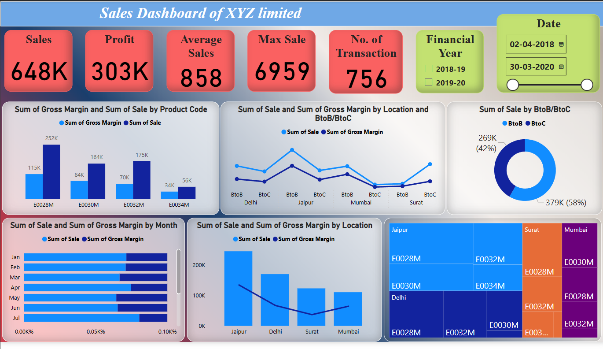

# 📊 Sales Dashboard - XYZ Limited

This Power BI dashboard provides a comprehensive overview of sales performance for **XYZ Limited** across different locations, product codes, and time periods. It enables stakeholders to gain insights into revenue trends, profitability, and transaction metrics for the financial years **2018–19** and **2019–20**.

---

## 🔍 Key Metrics

| Metric               | Value  |
|----------------------|--------|
| **Total Sales**      | 648K   |
| **Total Profit**     | 303K   |
| **Average Sales**    | 858    |
| **Max Sale**         | 6959   |
| **No. of Transactions** | 756 |

---

## 📅 Date Range & Filters

- **Date Range:** `02-04-2018` to `30-03-2020`
- **Financial Years:** 2018-19, 2019-20
- **Segment Filter:** B2B vs B2C breakdown
- **Location Filters:** Delhi, Jaipur, Mumbai, Surat

---

## 📈 Visual Insights

### 1. **Sales and Profit by Product Code**
- **E0028M** has the highest sales (252K) and gross margin (115K).
- **E0034M** has the lowest in both categories.

### 2. **Sales by Location and B2B/B2C**
- **Jaipur B2B** shows a peak in sales and gross margin.
- **B2C sales** are higher than B2B, contributing **58%** of total sales.

### 3. **Sales Trend by Month**
- Steady increase from January to July.
- Higher sales and gross margins during May–July.

### 4. **Sales and Profit by Location**
- **Jaipur** is the leading location in both sales and profit.
- **Mumbai** shows the lowest sales.

### 5. **Treemap View**
- Displays contributions by product code across all locations.
- Visually highlights strong performers like **E0028M in Jaipur** and **E0032M in Surat**.

---

## 📌 Purpose

This dashboard was developed to:
- Monitor overall and average sales performance.
- Analyze product-wise and location-wise profitability.
- Compare B2B vs B2C contributions.
- Support strategic business decisions using visual insights.

---

## 🛠 Tools Used

- **Power BI Desktop**

---

## ✨ Future Enhancements

- Include Year-over-Year comparison visuals
- Add Customer Segmentation analysis
- Integrate Forecasting visuals for predictive insights

---
  ## 📷 Dashboard Preview

